# Java CRUD MVC Playground


A clean and structured **Java MVC CRUD application** built using **Servlets, JSP, JDBC, and PostgreSQL**, following industry-standard design principles.

This repository is maintained as a **versioned learning playground**, where each release is **stable, tagged, and documented**, reflecting real-world development practices.

> **Current Stable Release:** `v1.2-search`

---

## ✨ Features (Current Version – v1.2 Search)

### Core CRUD
- Add Student
- View Student List
- Edit Student
- Delete Student

### Pagination
- First / Previous / Next / Last navigation
- Page size selector
- Go-to-page input
- Record range display (e.g. 11 → 20 of 87)
- Performance-friendly SQL using `LIMIT` and `OFFSET`

### 🔍 Search (NEW in v1.2)
- Search students by **name**, **email**, or **mobile**
- Case-insensitive search (PostgreSQL `ILIKE`)
- Search preserved across:
  - Pagination navigation
  - Page size change
  - Go-to-page action
- Seamlessly integrated with existing pagination logic

### Validation
- Client-side validation using HTML5
- Server-side validation in Servlet

### UI / UX
- Responsive layout using Bootstrap 5
- Properly aligned search bar and action buttons
- Clean table layout with consistent spacing
- User-friendly success and error messages

### Exception Handling
- Centralized `DAOException`
- Dedicated error page (`error.jsp`)

---

## 🛠️ Technology Stack

| Layer | Technology |
|------|-----------|
| Frontend (View) | JSP, HTML5, CSS3, Bootstrap 5 |
| UI Icons | Font Awesome |
| Controller | Jakarta Servlet API |
| Backend (Business Logic) | Java |
| Database Access | JDBC |
| Database | PostgreSQL |
| Application Server | Apache Tomcat 11 |
| Build Tool | Maven |
| Architecture Pattern | MVC (Model–View–Controller) |
| Version Control | Git & GitHub |

---

## 📁 Project Structure

```
java-crud-mvc-playground
│
├── src/main/java
│   └── com/nsgacademy/crudmvc
│       ├── model                # Domain & request models
│       │   ├── Student.java
│       │   ├── Pagination.java
│       │   └── StudentFilter.java
│       │
│       ├── dao                  # Data Access Layer (JDBC)
│       │   └── StudentDAO.java
│       │
│       ├── exception            # Centralized exception handling
│       │   └── DAOException.java
│       │
│       ├── utils                # Utility & Infrastructure classes
│       │   └── JDBCUtils.java
│       │
│       └── web                  # Controller layer (Servlets)
│           └── StudentServlet.java
│
├── src/main/webapp               # View Layer (JSP)
│   ├── student-list.jsp
│   ├── student-form.jsp
│   └── error.jsp
│
├── screenshots                   # Versioned UI screenshots
│   ├── v1.0
│   ├── v1.1
│   └── v1.2
│
├── pom.xml
└── README.md
```

---

## 🧠 Architecture Overview

The application follows **classic MVC (Model–View–Controller)** architecture.

- **Model**
  - Domain entities (`Student`)
  - Request helpers (`Pagination`, `StudentFilter`)

- **DAO Layer**
  - Contains all SQL queries
  - Handles pagination and search at database level

- **Controller (Servlet)**
  - Routes HTTP requests
  - Performs server-side validation
  - Combines search + pagination logic

- **View (JSP)**
  - Responsible only for UI rendering
  - No JDBC or business logic

### Design Rules Followed
- No SQL in JSP
- No JDBC in Servlet
- Pagination applied last in queries
- Search logic reusable and extendable

---

## 🗄️ Database Schema

```sql
CREATE TABLE students (
    id SERIAL PRIMARY KEY,
    name   VARCHAR(50) NOT NULL,
    email  VARCHAR(100) NOT NULL,
    mobile VARCHAR(10) NOT NULL
);
```

---

## ⚙️ Configuration

### Database Configuration

Update database credentials in `JDBCUtils.java`:

```java
private static final String URL  = "jdbc:postgresql://localhost:5432/studentdb";
private static final String USER = "postgres";
private static final String PASS = "password";
```

---

## ▶️ How to Run the Application

1. Install **JDK 17+**
2. Install and run **PostgreSQL**
3. Create database `studentdb`
4. Configure **Apache Tomcat 11**
5. Clone repository:
   ```bash
   git clone https://github.com/sureshagrawal/java-crud-mvc-playground.git
   ```
6. Import project as **Maven Project**
7. Deploy on Tomcat
8. Access:
   ```
   http://localhost:8080/<context-root>/students
   ```

---

## 🏷️ Versioning Strategy (Planned Roadmap)

This project follows **incremental, tagged releases** to ensure stability.

| Version              | Features                                   |
|----------------------|--------------------------------------------|
| v1.0-crud            | Core CRUD (current stable)                 |
| v1.1-pagination      | Pagination                                 |
| v1.1.1-docs          | Documentation & screenshots                |
| v1.1.2-bugfix        | Pagination bug fix (pageSize preservation) |
| **v1.2-search**      | **Search with pagination (current)**       |
| v1.3-sorting         | Sorting                                    |


Each version will be **independently stable and tagged**.

---

## 🔮 Future Architecture Direction

This project is intentionally designed to align with modern Spring-based applications.

Planned transitions:
- Servlet MVC → Spring MVC
- JDBC → Spring Data JPA
- JSP → REST APIs + Frontend (React / Thymeleaf)
- Manual pagination → `Pageable`
- Manual filters → Specification / Criteria-based filtering

---

## ⚠️ Known Limitations (Intentional)

- No Service layer (kept simple for Servlet MVC)
- No ORM in early versions (JDBC used for clarity)
- No REST APIs yet
- Authentication not included in early versions

---

## 📸 Screenshots

### v1.0 – Core CRUD Functionality

| Feature                | Screenshot                                                   |
|------------------------|--------------------------------------------------------------|
| Student List           | 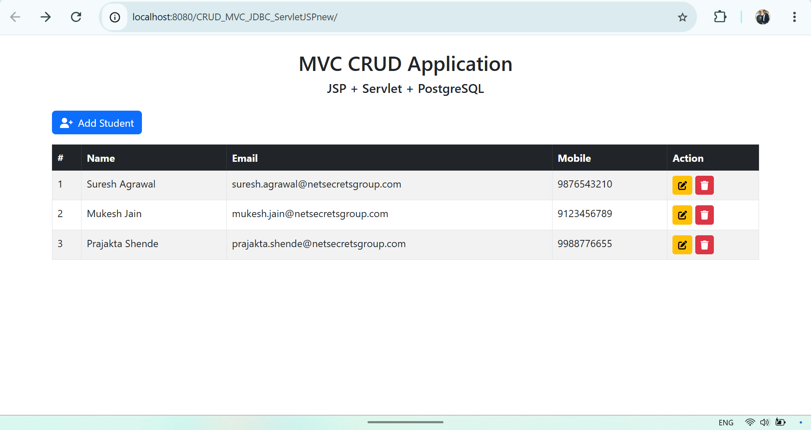                           |
| Delete Confirmation    | 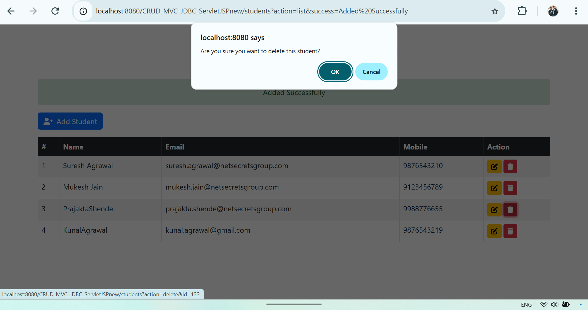               |
| Delete Success Message | 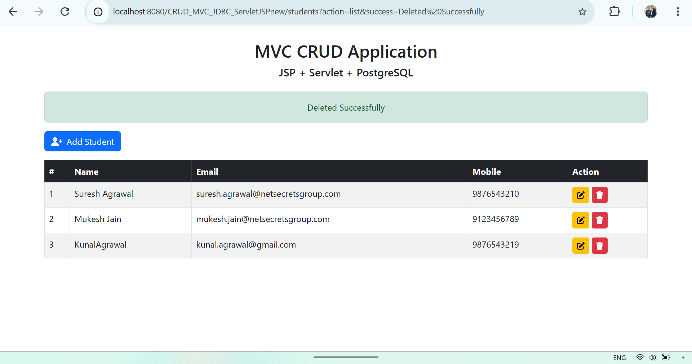      |
| Add Student            | 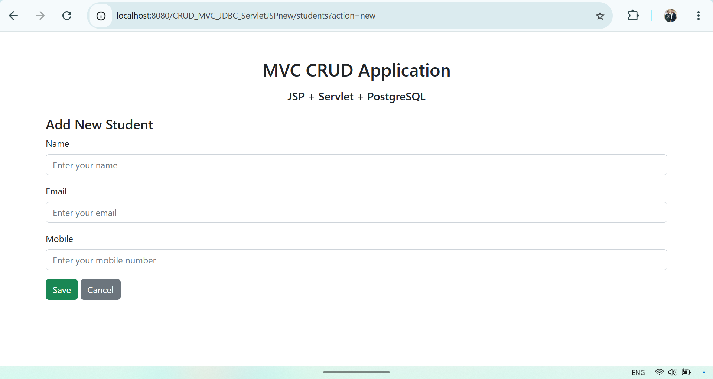                     |
| Add Success Message    | 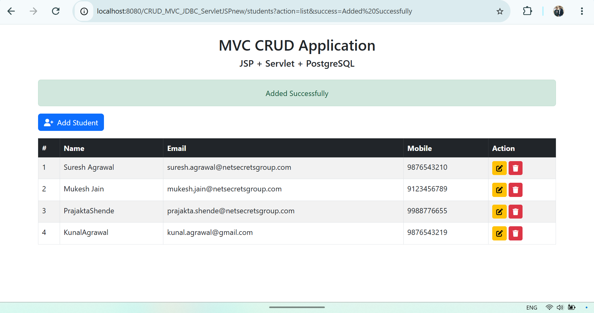         |
| Edit Student           | 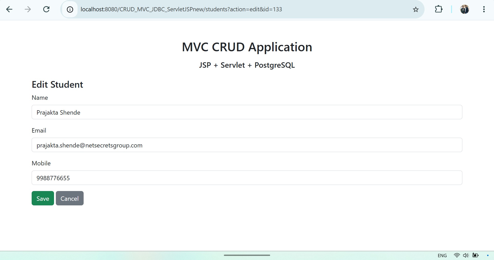                   |
| Update Success Message | 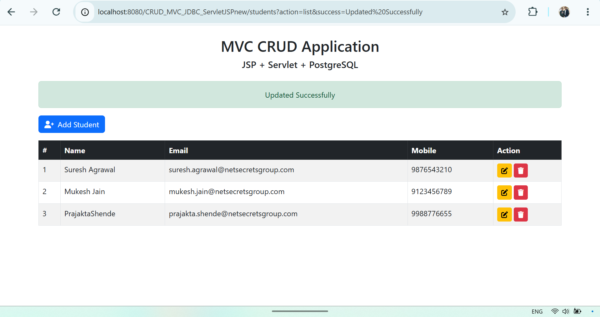      |
| Validation – Name      | 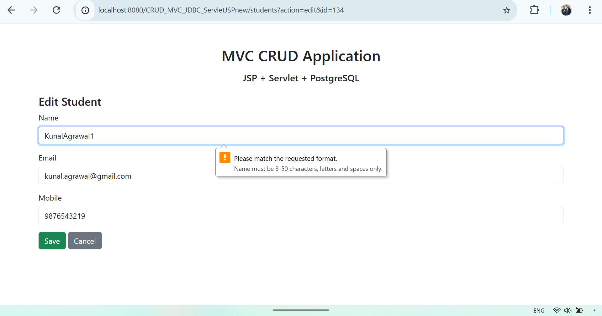     |
| Validation – Mobile    | 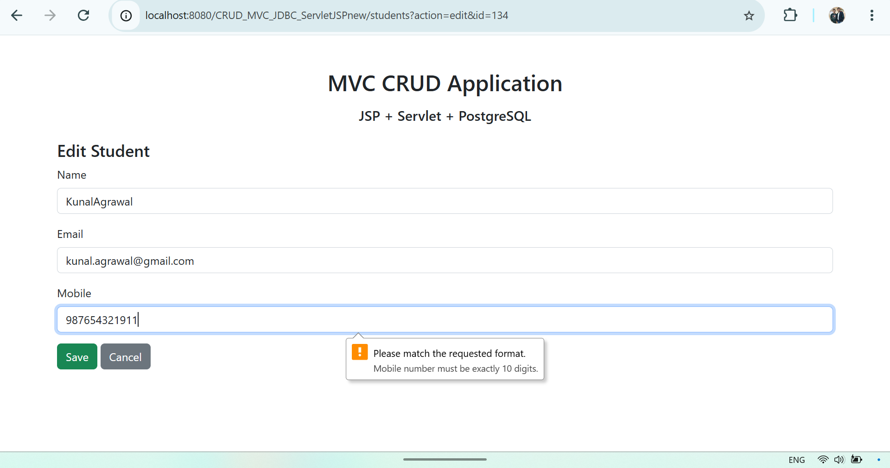 |
| Error Page             | 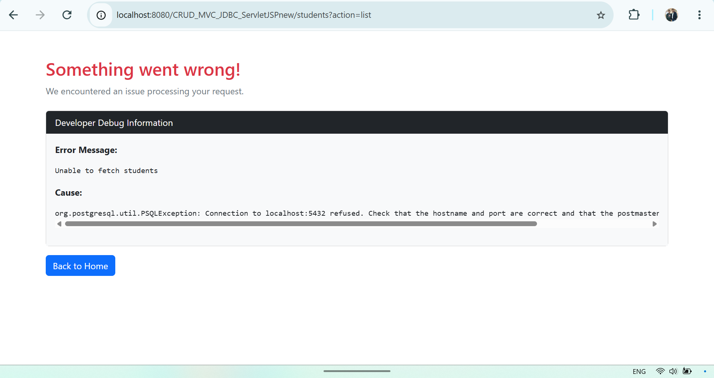                    |

---

### v1.1 – Pagination Enhancements

| Feature | Screenshot |
|-------|------------|
| Pagination Toolbar | 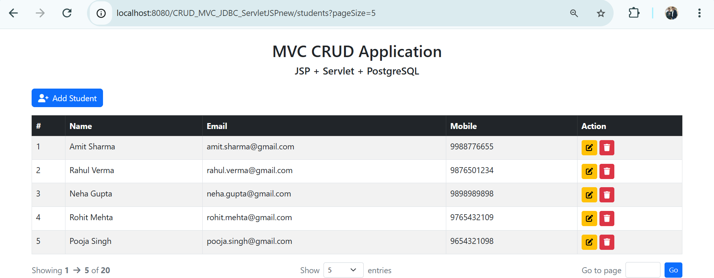 |
| Pagination Navigation | 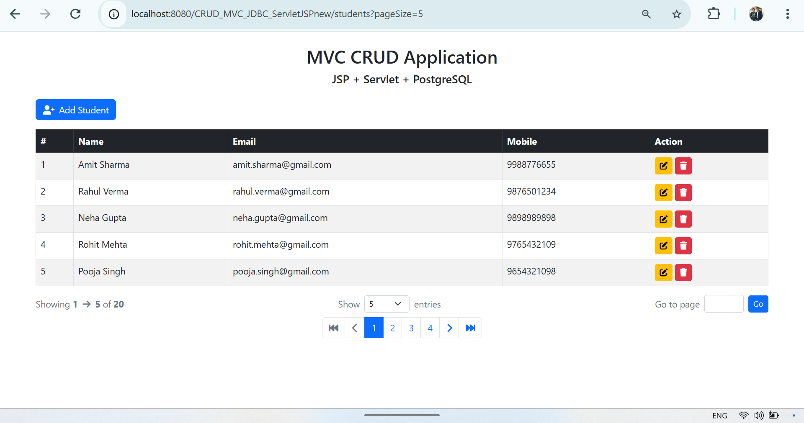 |

---

### v1.2 – Search with Pagination

| Feature | Screenshot                                            |
|-------|-------------------------------------------------------|
| Search Bar | 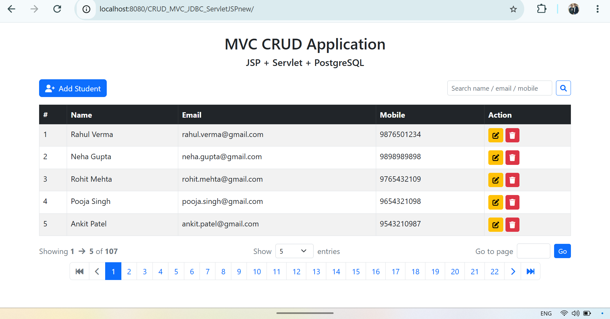           |
| Search + Pagination | 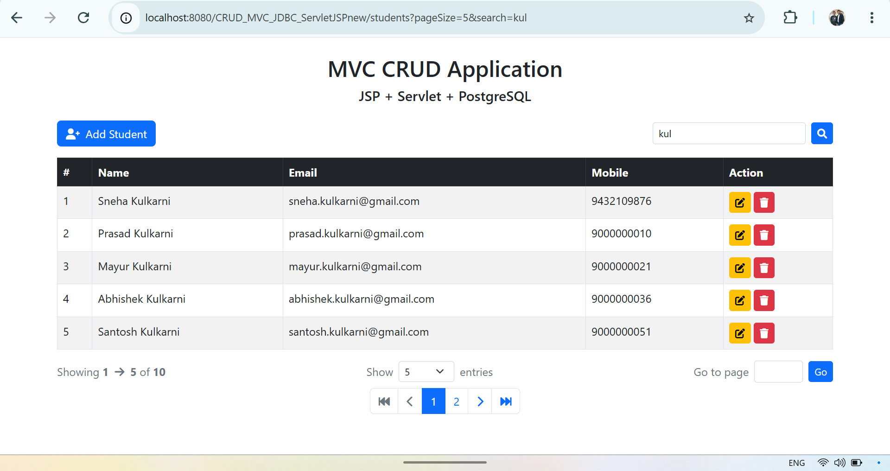    |
| Page Size Preserved | 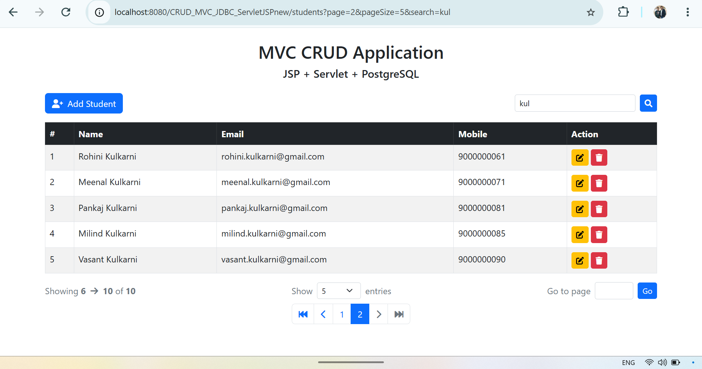 |

---

## 🎯 Purpose of This Project

- Learn MVC fundamentals deeply
- Build CRUD applications the right way
- Understand incremental feature evolution
- Prepare an interview-ready project
- Serve as a teaching and learning reference
- Act as a base for ORM migration (Hibernate / JPA)

---


## 🔮 Future Roadmap

- Import (CSV / Excel)
- Export (CSV, Excel, PDF, HTML)
- Advanced Fields (Gender, DOB, Age Calculation)
- Student Photo Upload
- Login system & Roles
- Advanced filters
- JSTL + EL (remove scriptlets)
- Spring MVC migration
- Hibernate / JPA integration
- REST APIs + React frontend

---

## 🤝 Contributing

Contributions are welcome for:
- Code improvements
- Refactoring
- Documentation
- Feature suggestions

Please create a feature branch and submit a pull request.

---

## 🧹 Git Hygiene

The repository includes a proper `.gitignore` to exclude:
- IDE configuration files
- Build artifacts
- Temporary files and logs

---

## 📄 License

This project is open-source and intended for **educational purposes**.

---

## 👤 Author

**Suresh Agrawal**  
Java Full Stack Developer & Trainer  

---

## 🙏 Acknowledgement

- Java open-source community
- Apache Tomcat & PostgreSQL teams
- Bootstrap & Font Awesome
- Students and developers who inspire continuous learning
